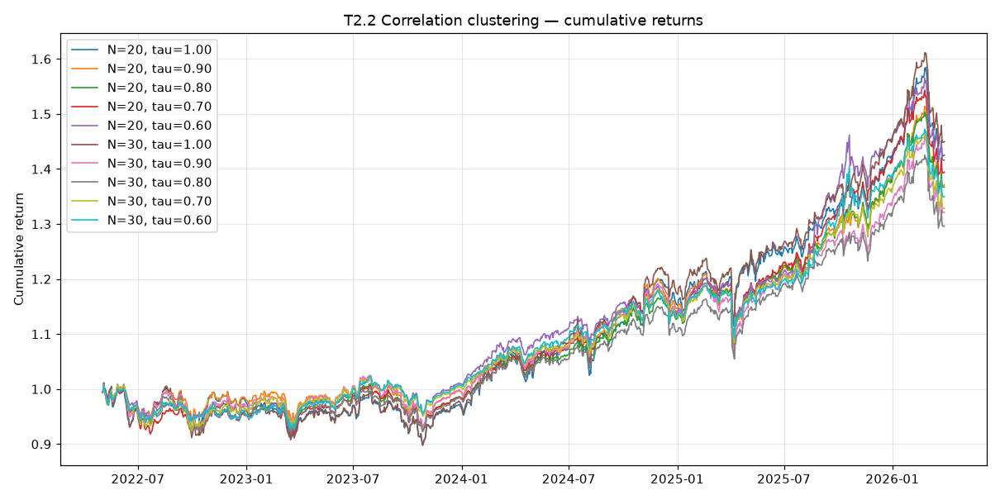

# T2.2 Correlation-Clustering Diagnostic

**Date generated:** 2026-07-10

**Data window:** 2022-04-29 to 2026-03-30 (3.9 years)
**Rebalance dates:** 48 (from cached rolling factor scores)
**Universe:** 724 tickers with cached price data
**Factor weights (from policy):** momentum=0.35, quality=0.30, volatility=0.20, value=0.15

## Results

| N positions | tau | CAGR | Vol | Sharpe | Sortino | Max DD |
|---:|---:|---:|---:|---:|---:|---:|
| 20 | 1.00 | +9.49% | +11.28% | +0.51 | +0.68 | -11.25% |
| 20 | 0.90 | +8.40% | +9.95% | +0.46 | +0.58 | -11.83% |
| 20 | 0.80 | +8.33% | +9.06% | +0.49 | +0.61 | -9.50% |
| 20 | 0.70 | +8.87% | +9.14% | +0.54 | +0.66 | -9.96% |
| 20 | 0.60 | +9.31% | +9.26% | +0.58 | +0.71 | -9.51% |
| 30 | 1.00 | +9.96% | +11.44% | +0.54 | +0.72 | -11.14% |
| 30 | 0.90 | +7.39% | +9.92% | +0.37 | +0.47 | -11.17% |
| 30 | 0.80 | +6.86% | +9.10% | +0.34 | +0.43 | -9.35% |
| 30 | 0.70 | +7.53% | +8.92% | +0.41 | +0.52 | -9.45% |
| 30 | 0.60 | +7.98% | +8.55% | +0.48 | +0.58 | -8.34% |

## Interpretation

**Baseline** (`tau = 1.0`) = current top-N-by-score behaviour.
**Clustered** (`tau < 1.0`) filters out candidates whose absolute
correlation with any already-picked position exceeds tau.

**Expected shape in a bull-heavy window:** clustering should 
underperform on CAGR — the winning cohort is highly correlated 
(tech, growth), and forcing decorrelation trades winners for 
lower-scored uncorrelated names. Look instead at max drawdown 
and Sortino for the diversification premium.

This test uses the 2021--2026 window from the cached rolling 
scores. Per the design note (`docs/research/2026-07_correlation_
clustering_design.md`), a multi-regime backtest across 2010--2020 
is where clustering is expected to show its true value. This 
backfill is on the roadmap.

## Plot

