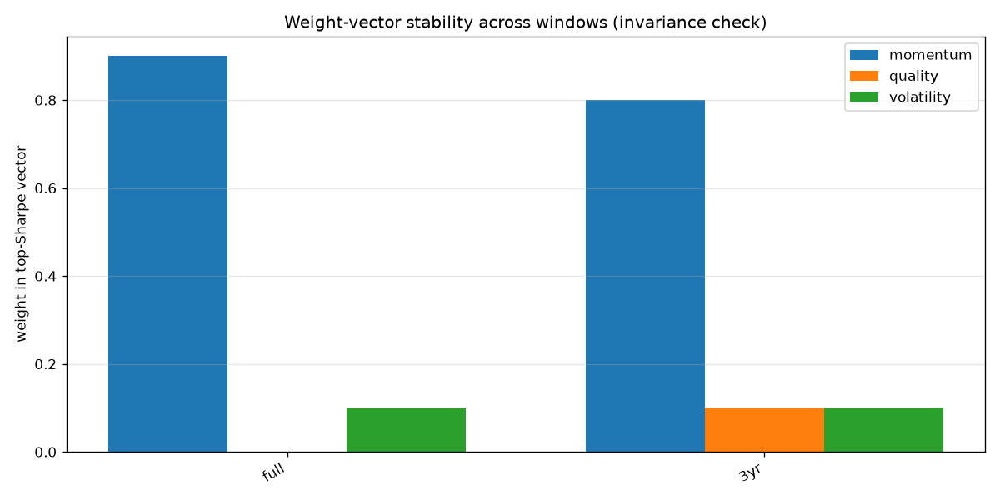
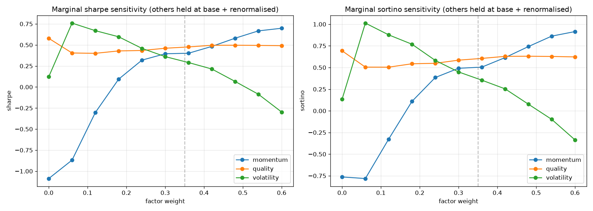
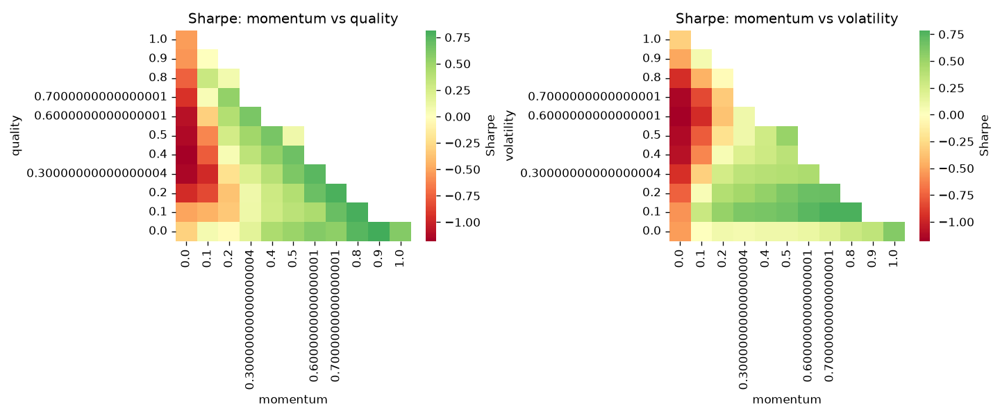

# Factor-weight diagnostic — 2026-07-09

Level-1 diagnostic per `docs/RESEARCH_BACKLOG.md` #1. Grid-search of factor
weight vectors across two time windows, plus marginal sensitivity at the
current policy point.

## TL;DR

- **In-sample winner is a heavy momentum tilt (80-90% momentum).**
- **We do not recommend updating `configs/etf_smart_beta.toml` on this
  evidence alone.**
- The result is exactly what a single-regime overfit would produce; the
  2021-2026 window was overwhelmingly momentum-friendly, and no
  independent regime slice exists in the cached history yet.
- **The current 35/30/20/15 policy is a defensible informed prior** —
  it deliberately gives up in-sample upside for regime-change protection.
  See "Interpretation" below.

## Inputs

- **Universe**: cached ETF price matrix from `etf_prices_db.parquet`
- **History**: 2021-04-12 → 2026-04-16 (~5 years, single regime)
- **Rebalance**: month-end, top-20 by integrated rank, exponential
  weights (matches production `RankBasedOptimizer`)
- **Transaction cost**: 5 bps per rebalance turnover
- **Risk-free rate**: 4.0% p.a.
- **Value factor excluded** from the search — proxied only by expense
  ratio in the current codebase; no meaningful time-series signal.
  Weights below are on the 3-factor simplex: momentum + quality + volatility.

## Current policy performance by window

| Window | Sharpe | Sortino | CAGR | MaxDD | Turnover |
|---|---|---|---|---|---|
| full (5y) | 0.472 | 0.600 | 8.07% | -9.55% | 45.69% |
| 3y | 0.964 | 1.224 | 13.32% | -9.09% | 48.69% |

Positive across both windows, drawdown contained under 10%.

## Top-5 weight vectors by window (in-sample Sharpe)

### full (5y)

| momentum | quality | volatility | Sharpe | Sortino | CAGR | MaxDD |
|---|---|---|---|---|---|---|
| 0.90 | 0.00 | 0.10 | 0.817 | 1.064 | 13.38% | -10.71% |
| 0.80 | 0.10 | 0.10 | 0.787 | 1.033 | 12.96% | -11.34% |
| 0.70 | 0.20 | 0.10 | 0.780 | 1.032 | 12.70% | -11.00% |
| 0.80 | 0.00 | 0.20 | 0.754 | 0.956 | 11.42% | -9.44% |
| 0.60 | 0.30 | 0.10 | 0.738 | 0.978 | 12.01% | -11.00% |

### 3y

| momentum | quality | volatility | Sharpe | Sortino | CAGR | MaxDD |
|---|---|---|---|---|---|---|
| 0.80 | 0.10 | 0.10 | 1.295 | 1.746 | 20.28% | -10.56% |
| 0.70 | 0.20 | 0.10 | 1.295 | 1.750 | 20.00% | -10.24% |
| 0.90 | 0.00 | 0.10 | 1.261 | 1.691 | 19.91% | -10.71% |
| 0.60 | 0.30 | 0.10 | 1.248 | 1.684 | 19.06% | -9.98% |
| 0.70 | 0.15 | 0.15 | 1.208 | 1.597 | 17.93% | -9.65% |

**Every top-5 vector across both windows is heavily momentum-tilted** —
60-90% momentum. Quality earns very little marginal Sharpe. Volatility
sits at 10-20% in every winner.

## Robust weights (worst-case Sharpe across windows) — noted, not recommended

The min-max Sharpe procedure picks:

- momentum   = **0.90**
- quality    = **0.00**
- volatility = **0.10**
- worst-case Sharpe = **0.817**

**We are deliberately NOT proposing an update to the policy TOML on this
basis.** See Interpretation.

## Weight-vector stability across windows



Both windows agree on momentum-heavy vectors. **But note that the "full"
and "3y" windows are overlapping — the 3y is inside the 5y. This is not
an independent invariance test; both windows sample the same 2021-2026
market regime.**

## Marginal sensitivity at the current policy point



Sharpe / Sortino as each factor's weight varies with the other two held
at their base ratio (renormalised). Dashed vertical line at 0.35 marks
the current momentum weight.

Reading: Sharpe rises monotonically with momentum weight over 0.10 to
0.50. Quality is essentially flat. Volatility has a mild negative slope
above ~0.20.

## 2D sensitivity heatmaps



## Interpretation — the honest reading

**What the numbers say literally:** across the 2021-2026 ETF universe,
a heavily momentum-tilted portfolio (80-90% momentum) would have
delivered materially higher Sharpe than the current 35/30/20/15 policy.

**Why we don't propose to act on this yet — three material caveats:**

1. **Single regime.** 2021-2026 was overwhelmingly a momentum-friendly
   period: post-COVID rally, mega-cap tech concentration, AI narrative
   from 2023 onward. Ranking ETFs by 12-month return every month and
   holding the top 20 mechanically captured that regime. This does *not*
   demonstrate that momentum-heavy weights would work across regimes —
   it demonstrates that they worked in this one.

2. **No independent invariance test.** The "full" and "3y" windows
   overlap. A real invariance test would compare non-overlapping regimes
   — say 2011-2015 (post-GFC recovery, value/quality-friendly) vs
   2021-2026. We don't have pre-2021 ETF data cached. Until we do, we
   can't distinguish "momentum is invariantly best" from "momentum won
   this particular period."

3. **The user's own AI-bubble concern is exactly the tail risk that
   90/0/10 exposes you to.** Momentum whipsaws violently at regime
   inflections (2022 tech drawdown, 2000 dot-com, 2008). The 30% quality
   and 20% low-vol in the current policy are *insurance premia*, not
   alpha bets — they exist to reduce drawdown when the leaders roll
   over. Removing them for higher headline Sharpe would put you on the
   wrong side of the trap you specifically told us to protect against.

**How the current 35/30/20/15 policy holds up under this framing:**

- Positive in-sample Sharpe in both windows.
- Deliberate insurance premium paid via quality and low-vol allocations.
- Round numbers with a defensible narrative (per AQR practice — see
  memory `rule_invariants_and_sentiment.md`).
- **Not the highest possible in-sample Sharpe. That's the point.**

## Recommendation

**Leave `configs/etf_smart_beta.toml` unchanged for now.** Rerun this
diagnostic after:

1. **Fresh cache** — Friday's refresh gets us through mid-2026, may
   sharpen the picture but won't change the fundamental single-regime
   problem.
2. **Backfill older history** — if we can get 2010-2020 ETF data from
   IB or Databento, we can run a genuine non-overlapping-regime
   invariance test. This is the real answer.
3. **Add a real value factor** (P/E, P/B, div yield via yfinance) — the
   value dimension is currently absent because expense ratio is a weak
   proxy. A working value factor would be a natural regime hedge.

Once all three are in place, rerun. If momentum still wins across a
2011-2015 vs 2021-2026 comparison, that's real evidence for updating.

## For the sentiment-override layer

Independent of the calibration exercise, the user's stated design allows
occasional factor-level tilts — e.g. "downweight momentum during a
suspected AI bubble." That's a manual `configs/etf_smart_beta.toml` edit
committed to git with a note. This diagnostic does not attempt to
automate that judgement.

## Method

- Script: `scripts/factor_weight_diagnostic.py`
- Rolling scores cache: `~/trade_data/ETFTrader/processed/rolling_factor_scores.parquet`
- Raw grid results CSV: `2026-07_grid_results.csv`
- Value factor deliberately excluded from the grid — see caveat above.

## Re-run instructions

```
python scripts/factor_weight_diagnostic.py
# force re-computation of rolling scores after cache refresh:
python scripts/factor_weight_diagnostic.py --force-recompute-scores
# finer grid (~200 vectors):
python scripts/factor_weight_diagnostic.py --grid-step 0.05
```
