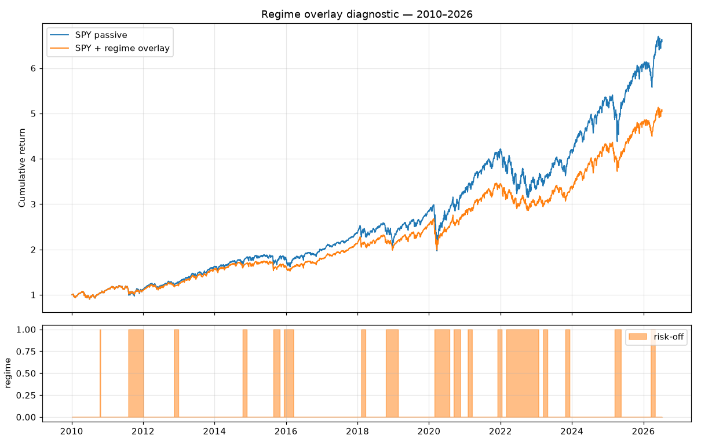

# T2.1 Regime Overlay Diagnostic

**Date generated:** 2026-07-10
**Data window:** 2010-01-04 to 2026-07-09 (16.5 years)
**Source:** SPY + ^VIX daily from FMP `historical-price-eod/full`

## Config (per `RegimeConfig` defaults)

- Trend SMA: 200 days
- VIX threshold: 25.0
- Hysteresis window: 10 days
- Minimum dwell: 30 days
- Risk-off equity multiplier: 0.6

## Regime statistics

- Total trading days: **4153**
- Risk-on days: **3185** (76.7%)
- Risk-off days: **968** (23.3%)
- Total switches (on↔off): **34**
- Average risk-off spell: **~57 days** (if switches > 0)

## Performance

| Metric | SPY passive | SPY + overlay | Delta |
|---|---:|---:|---:|
| CAGR | +12.15% | +10.35% | -1.79% |
| Volatility | +17.17% | +13.75% | -3.42% |
| Sharpe | +0.52 | +0.50 | -0.03 |
| Sortino | +0.65 | +0.63 | -0.01 |
| Max drawdown | -34.10% | -25.67% | +8.44% |

## Interpretation

The regime overlay's job is to **improve drawdown-adjusted return**, not
necessarily raw CAGR. In a bull-heavy sample the overlay may lag on CAGR by
sitting out productive risk-on days that briefly triggered risk-off, but
should show meaningful gains on max drawdown and Sortino.

Read the CAGR delta not as "does the overlay make more money" but as "what
premium do we pay for the drawdown protection". A modest CAGR drag paired
with a large max-drawdown improvement is the intended outcome; a CAGR drag
with no drawdown improvement is a sign the signal is too jumpy.

## Plot

## Files

- Report: `docs/research/2026-07_regime_diagnostic.md`
- Plot: `docs/research/2026-07_regime_diagnostic.png`
- Module under test: `src/portfolio/regime.py`
- Unit tests: `tests/test_portfolio/test_regime.py`
